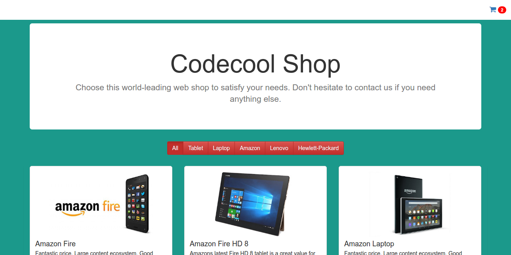

#### Codecool Online Shop

From Python To Java, 2nd - 3rd TW week, Project skeleton

#### install

Import this project to IntelliJ as a Maven project.
IntelliJ can auto-install the dependencies from the pom.xml

#### preparation

The choice is yours to switch between implementations: store data in memory or in your database.
In order to do that, change ProductService, ProductCategoryService and SupplierService files in the folder service.
ENUM and Factory Pattern helps you to switch implementation: 

###### this.*** = StorageFactory.set****Storage(Storage.DATABASE/MEMORY)

#### to run the application

- default settings: jdbc:postgresql://localhost:5432/postgres; postgres; postgres
- set your db with running init_db.sql in sql folder
- run test_data.sql to add example data to the app
- run the microservices one by one: EmailOrderStoreServer, EmailSendServer then the main application's Server 

# ||| Preview |||

#### about tests

If you want to run test cases, don't forget to clean up all your tables: empty db is required!
